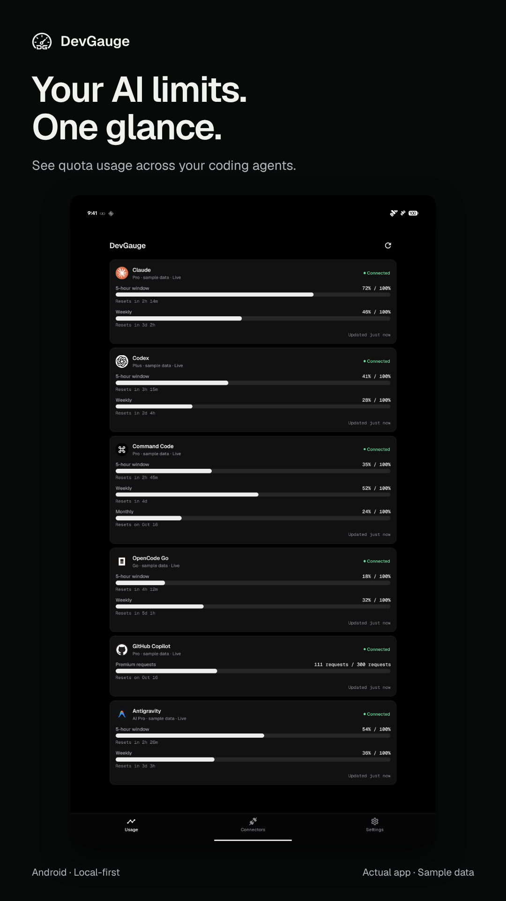
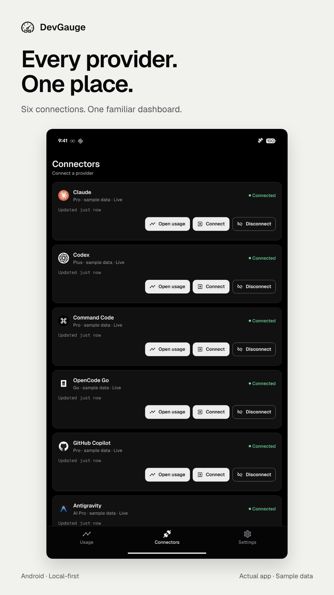
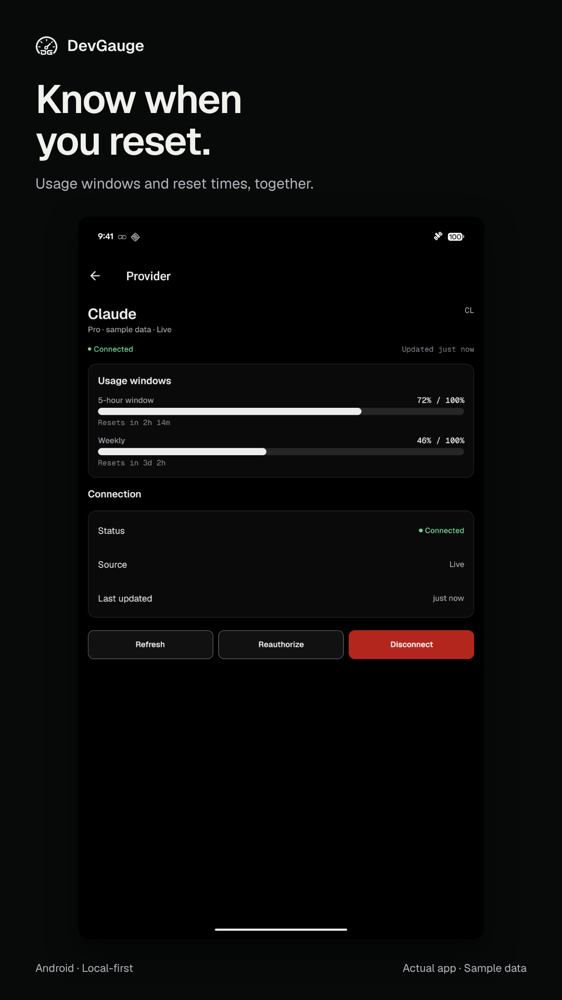
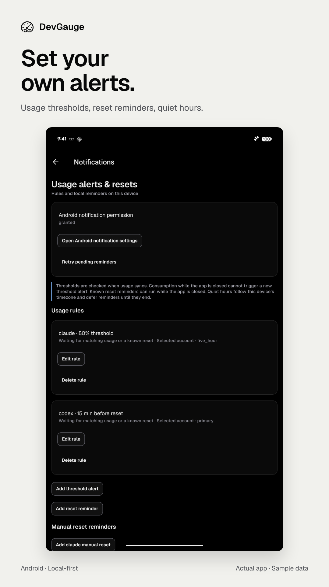
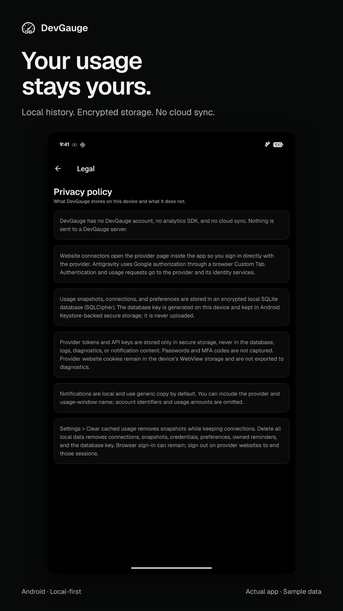

<p align="center">
  
</p>

<h1 align="center">DevGauge</h1>

<p align="center">
  <strong>Your coding-agent usage, in one place.</strong><br />
  An Android application for tracking provider quotas, reset windows, and usage alerts directly on your device.
</p>

<p align="center">
  <a href="LICENSE"></a>
  <a href="https://github.com/ahmad9059/devgauge/releases"></a>
  <a href="https://github.com/ahmad9059/devgauge/actions/workflows/ci.yml"></a>
  
  
  
  <a href="https://github.com/ahmad9059/devgauge/stargazers"></a>
</p>

<p align="center">
  <a href="#overview">Overview</a> ·
  <a href="#screenshots">Screenshots</a> ·
  <a href="#features">Features</a> ·
  <a href="#providers">Providers</a> ·
  <a href="#installation">Installation</a> ·
  <a href="#getting-started">Getting started</a> ·
  <a href="#documentation">Documentation</a> ·
  <a href="CONTRIBUTING.md">Contributing</a>
</p>

---

## Screenshots

See all six providers in the usage dashboard, manage connections, inspect reset windows, and configure local alerts. These are real Android app captures with illustrative sample data. Select an image to view it at full size.

<p align="center">
  <a href="assets/screenshots/01-dashboard.png"></a>
  <a href="assets/screenshots/02-providers.png"></a>
  <a href="assets/screenshots/03-limits.png"></a>
</p>

<p align="center">
  <a href="assets/screenshots/04-alerts.png"></a>
  <a href="assets/screenshots/05-privacy.png"></a>
</p>

## Overview

DevGauge brings coding-agent usage into a single dashboard. Connect your provider accounts, check how much quota you have used, and see when your limits reset without moving between multiple provider websites.

The application is local-first. Connection metadata, usage snapshots, and preferences are stored on your device. Authentication and refresh requests go to the selected providers and their identity services; usage history is not uploaded to a DevGauge backend.

The repository includes the Android application, provider integrations, encrypted storage, background refresh, and local notification scheduling. The first release is **DevGauge 1.0.0**, distributed as a signed ARM64 APK through [GitHub Releases](https://github.com/ahmad9059/devgauge/releases).

## Features

- **Unified usage dashboard:** view connected providers, quota consumption, plan information, and snapshot timestamps.
- **Provider details:** inspect individual usage windows, reset times, and shared model pools where available.
- **In-app website connections:** sign in to website-based providers using a persistent embedded session.
- **Antigravity authentication:** authorize through a Google browser flow and store the resulting credentials securely.
- **Foreground refresh:** refresh on application startup and return to the foreground, with freshness checks to avoid unnecessary requests.
- **Background refresh:** request periodic Android refresh with a six-hour minimum interval.
- **Resilient synchronization:** refresh eligible providers concurrently, retry temporary failures, and preserve previous successful snapshots.
- **Usage alerts and reset reminders:** configure thresholds, quiet hours, and local reminders from Settings.
- **Local data controls:** clear cached usage, disconnect individual providers, or delete application data.
- **Adaptive appearance:** light and dark themes, adjustable text sizing, and Geist typography.

Percentages represent quota used. Unknown values remain unknown rather than being displayed as zero. Available windows depend on the provider, account plan, and data returned during refresh.

## Providers

| Provider       | Connection method                         | Usage coverage                                                              |
| -------------- | ----------------------------------------- | --------------------------------------------------------------------------- |
| Claude         | In-app website session                    | Five-hour and weekly limits, including model-specific windows when returned |
| Codex          | In-app website session                    | Five-hour and weekly quotas with reset information                          |
| Command Code   | In-app website session                    | Five-hour, weekly, and monthly windows when available                       |
| OpenCode Go    | In-app website session                    | Provider-reported usage windows                                             |
| GitHub Copilot | In-app website session                    | Monthly request allowance and provider-reported usage                       |
| Antigravity    | Google OAuth through a browser Custom Tab | Aggregate five-hour and weekly quotas, plus model-family pool details       |

Website integrations read the usage exposed by first-party pages. Page changes, session expiration, account permissions, and provider availability can affect refresh. Reconnect an expired session from the Connectors screen or use **Reauthorize** in provider details.

DevGauge is an independent project and is not affiliated with or endorsed by these providers.

## Installation

### Install from GitHub Releases

1. Open [GitHub Releases](https://github.com/ahmad9059/devgauge/releases).
2. Download `devgauge-1.0.0-arm64.apk` from the v1.0.0 release assets.
3. Allow installation from your browser or file manager when Android prompts you.
4. Open the APK and install DevGauge.

The release includes a `.sha256` checksum file for verifying the download. Release builds use package ID `app.devgauge` and do not expose development diagnostics.

Development and preview installations use separate package IDs. The release installs alongside them and does not import their connections or usage history. Connect your providers in the release app after installing it.

### Requirements

- An Android device or emulator with the `arm64-v8a` architecture.
  The release requires Android 7.0 (API 24) or later.
- Node.js 24 LTS and npm for building from source.
- Android Studio, an Android SDK, and a compatible Java runtime for local Android builds.
- A provider account for each connector you want to use.

All configured Android builds package ARM64 native libraries only. Intel x86 and x86_64 emulators are not supported by these artifacts.

### Build the release APK from source

```sh
git clone https://github.com/ahmad9059/devgauge.git
cd devgauge
npm ci
cp .env.example .env
npm run android:release-apk
```

If you intend to use Antigravity, configure the OAuth client values documented in `.env.example` before building. Keep `.env` local. Values prefixed with `EXPO_PUBLIC_` are included in the application bundle and must not be treated as confidential server secrets.

The completed APK is written to:

```text
artifacts/devgauge-1.0.0-arm64.apk
artifacts/devgauge-1.0.0-arm64.apk.sha256
```

Install it using Android Debug Bridge with a connected device:

```sh
adb install -r artifacts/devgauge-1.0.0-arm64.apk
```

The build reports progress and elapsed time. Full output is recorded in `artifacts/android-build-release.log`. On the first run, it creates a persistent signing key and credentials in the ignored `.release/` directory. Back up that directory securely: future updates must use the same key. A source build with a different signing key cannot update an installed official APK in place.

See the [release guide](docs/release/github-release.md) for checksum verification, signing-key handling, and GitHub publication steps.

## Getting started

1. Open DevGauge and select **Connectors**.
2. Choose **Connect** beside a provider. Website providers open an embedded sign-in page. Antigravity opens its authorization screen and browser flow.
3. Complete sign-in. DevGauge captures the available usage and updates the dashboard.
4. Open **Usage** to compare connected providers. Select a card for detailed quota and reset information.
5. Use the top-right refresh control to refresh eligible connections, or refresh an individual provider from its detail screen.
6. Open **Settings > Usage alerts & resets** to configure local alerts and reminders.

When no providers are connected, the Usage screen provides an **Open connectors** action.

### Refresh behavior

Refresh uses a concurrency limit of two providers. Temporary network, server, and timeout failures receive an initial attempt plus up to three retries with backoff. Authentication failures, incompatible responses, and rate limits end the immediate retry batch. Failed refreshes retain the last successful data.

Android background work is scheduled through WorkManager with a minimum interval of 360 minutes. This is a scheduling interval, not an exact execution time. Android can defer work based on battery and network conditions. Force-stopping the application pauses scheduled execution until the app is reopened.

Threshold alerts depend on usage observed during a refresh. Reset reminders can use known reset times and run through Android's local notification scheduler.

## Privacy and security

| Data                                                           | Storage and handling                           |
| -------------------------------------------------------------- | ---------------------------------------------- |
| Connections, usage snapshots, settings, and notification rules | Local SQLCipher-encrypted SQLite database      |
| Provider tokens and stored credentials                         | Expo SecureStore backed by Android Keystore    |
| Database encryption key                                        | SecureStore, separate from the database        |
| Website sign-in cookies                                        | App-private persistent Android WebView storage |
| Alerts and reset reminders                                     | Android local notification scheduling          |

The application does not include an analytics or advertising SDK. Provider authentication pages and identity services have their own data-handling policies.

### Disconnecting and deleting data

- **Connectors > Disconnect** removes the stored credential and cancels the connection's refresh and reminders while preserving local usage history.
- **Provider details > Disconnect** removes the connection and its local history after confirmation.
- **Settings > Clear cached usage** removes stored snapshots while keeping connections.
- **Settings > Delete all local data** removes connections, snapshots, credentials, preferences, owned reminders, and the database encryption key.

Browser and WebView sign-in sessions can remain after disconnecting or deleting local data. Sign out on the provider's website to end those sessions. Disconnecting locally does not guarantee remote token revocation.

Read the [security policy](SECURITY.md) for vulnerability reporting and the [privacy and data inventory](docs/release/privacy-data-inventory.md) for implementation details.

## Development

### Start a development build

After installing dependencies and preparing an ARM64 device or emulator:

```sh
npm run android
```

For an existing development build, start the JavaScript development server with:

```sh
npm start
```

DevGauge includes a native session module and native storage integrations. Use a development build rather than Expo Go.

### Validation

```sh
npm run check
npm run format:check
```

`npm run check` runs TypeScript validation, ESLint, unit tests, and application configuration checks. Formatting is checked separately.

CI also runs Expo compatibility checks, a production Android bundle export, and the [dependency audit policy](docs/release/dependency-audit.md). The policy records exact, expiring exceptions for two unpatched build-tool advisories and fails on unreviewed high or critical findings.

### Project structure

```text
app/                  Screens and navigation routes
assets/               Application branding and provider logos
modules/              Native Android session capture module
src/components/       Shared interface components
src/design/           Themes, typography, and design tokens
src/domain/           Provider and usage domain models
src/features/         Dashboard, connection, and application workflows
src/providers/        Provider adapters and Antigravity integration
src/services/         Refresh, authentication, notifications, and sessions
src/storage/          Encrypted persistence and secure credential storage
scripts/              Build, configuration, and asset utilities
docs/                 Architecture, operations, release, and implementation notes
```

### Production configuration

`APP_VARIANT` selects `development`, `preview`, or `production`. Production defaults to application ID `app.devgauge`. The local release command produces a signed APK with diagnostics disabled. `ANDROID_PACKAGE` can override the ID for a separate distribution.

The `release` EAS profile produces an APK and the `production` profile produces an Android App Bundle. EAS signing credentials must match the official local release key if both build services are used for the same application.

See [app.config.ts](app.config.ts), [eas.json](eas.json), and the [release guide](docs/release/github-release.md) for build and distribution details. Internal development APKs remain available through `npm run android:preview-apk`.

## Documentation

| Topic                    | Reference                                                                                 |
| ------------------------ | ----------------------------------------------------------------------------------------- |
| Architecture             | [Application architecture](docs/plans/devgauge-mobile-provider-dashboard/ARCHITECTURE.md) |
| Storage                  | [Database design](docs/plans/devgauge-mobile-provider-dashboard/DATABASE.md)              |
| Technical decisions      | [Architecture decision records](docs/decisions/)                                          |
| Data handling            | [Privacy and data inventory](docs/release/privacy-data-inventory.md)                      |
| Device validation        | [Mobile QA matrix](docs/release/mobile-qa-matrix.md)                                      |
| Release preparation      | [GitHub release guide](docs/release/github-release.md)                                    |
| Provider troubleshooting | [Provider incident runbook](docs/operations/provider-incident-runbook.md)                 |

Implementation plans and execution logs document historical development decisions. Current behavior should be confirmed against the application code and build configuration.

## Community and contributing

Bug reports, documentation improvements, and focused pull requests are welcome. Include reproduction steps and sanitized screenshots when reporting a problem. Never attach provider credentials, cookies, authorization callbacks, or unredacted account data.

- [Contributing guidelines](CONTRIBUTING.md)
- [Code of conduct](CODE_OF_CONDUCT.md)
- [Issue tracker](https://github.com/ahmad9059/devgauge/issues)
- [Security reporting](SECURITY.md)

## License

DevGauge source code is licensed under the [MIT License](LICENSE).

Provider names and logos belong to their respective owners. Their inclusion identifies supported integrations and does not imply endorsement. Third-party dependencies retain their own licenses.
